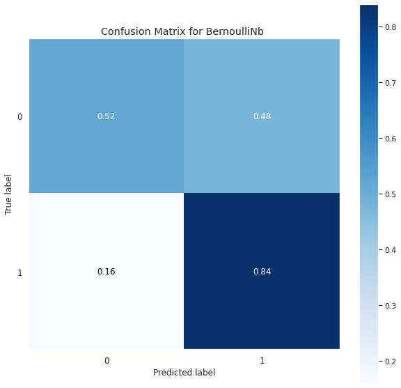
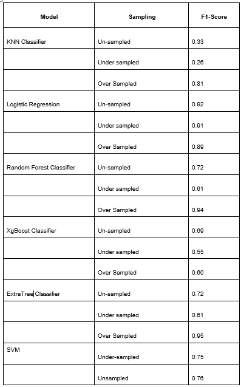

# Abstract

The world is drastically shifting towards the era of online shopping and social media. People find it extremely feasible and less time-consuming to shop online by just sitting and shopping for anything and everything they need from the comfort of their homes. This leads to minimal customer-manufacturer interaction and for this reason, it raises a concern for the suppliers to figure out their product performance and analyze feedback. A manufacturer requires constant feedback on how their products are doing in the market and the level of customer satisfaction that they are delivering. Therefore, to address this, we have a need for sentiment classification of consumer feedback and product reviews that are purchased by consumers on online platforms. This approach will help in categorizing data based on certain attributes which will make it easier to analyze and observe the trends/reviews of products. In this project, we have implemented various machine learning models for reviews prediction and sentiment classification. We have compared the performance of different models to determine which model performs the best for our data. 

# Introduction[^1]
[^1]:Introduction

With the rise in online shopping these days, companies are quickly improving their online services for their customers. Different brands are constantly working to figure out ways to retain their existing customers while also attracting new customers. Customer satisfaction and online reviews play a big part in businesses today. Understanding the performance and reviews of their products is crucial for both producers and sellers in the internet age. Artificial Intelligence and Machine Learning is widely being used for this purpose. Depending on the type of data and the domain for which it is used, many machine learning models are available that can be deployed based on the performance. Determining the review rating of a given product or whether the review on a given product is positive or negative will help in correlating to the customer’s satisfaction and improving the sales of these products. 

The objective of this project is to explore and implement different machine learning models for electronic product reviews dataset and study the performance of each model. Different error metrics will be computed, and their corresponding confusion matrix will be plotted, to understand the model's performance. We compare each model's performance to the others based on these error metrics after implementing all the potential models. 

### Dataset (Online Product Reviews Data)[^2]:
[^2]:Dataset (Online Product Reviews Data) 
We have obtained this from open source contribution.Initially data is very less which contains 7000 rows .So we have reanalysed and decided to take theother dataset which is similar and merged using simialr columns

https://data.world/datafiniti/amazon-and-best-buy-electronics [from data.world]

https://data.world/datafiniti/grammar-and-online-product-reviews [from data.world]

## 2.1 Data exploratory
# 2.2 Data distribution
Every data what we found in internet is biased .Even we faced the similar issue.This has been overcome with some techniques which was given below in Handling Data Imbalance[^2.4.1]
<figure style='width:100%'>

<figcaption align = "center">
	<b>\phantom{....}Fig Data Distribution</b>
</figcaption>
</figure>

In this figure we can clearly more number of data points conists in rating-5 class only,and then we checked with length of reviews and rating.
<figure style='width:100%'>

<figcaption align = "center">
	<b>\phantom{....}Fig 2.2.1 length of reviews vs rating</b>
</figcaption>
</figure>

## 2.3 Data Cleaning and Preprocessing

The performance of any machine learning model depends significantly on data cleaning and pre-processing. Therefore, we have employed a selected number of techniques to clean the raw text data. The different types of pre-processing techniques used in this project are:

Lowercasing: Convert all the characters of the text in the reviews to lowercase. It is done to maintain the consistency of the text to train for predicting the output and avoid sparsity issues.

Lemmatization: It is a technique similar to stemming where the inflexions are removed and mapped to their corresponding root word. This technique is used to make all similar words to be uniform.

Stop-word removal: Stop-word removal is used to remove the commonly used words so that the model can focus on the keywords while training.

Drop Null and Duplicate values: The rows without the data for the essential metrics that are used to predict the output or containing duplicate records have been dropped from the dataset, and the columns that are not necessary have been omitted from the dataset.

## 2.4 Handling Data Imbalance

An imbalance of data sets can result in a biased training model, towards the majority class. In order to tackle this problem, certain methods were experimented with.
### 2.4.1 Nearmiss

a.    Under-sampling - This method focuses on reducing the sample size of all the classes to the size of the minority class. Near Miss technique was used to implement under-sampling in the data set. Although this technique balances the data points, it eliminates good sample points, thereby leading the model to not perform the best.
### 2.4.2 SMOTE
b.    Over-sampling - This method focuses on upscaling the sample sizes of all the classes based on the majority class size. SMOTE technique was used to implement this part of the code. SMOTE produces synthetic samples based on the already existing samples in each class. Oversampled data performed better than the under-sampled one in all the classification/regression methods.

# 3 Methods

Text classification can be implemented using various machine learning models. The ML algorithms used in this project are:

### 3.1 RandomForest Classifier: 

Random Forest is a supervised learning decision tree-based model. On randomly chosen data samples, random forests generate decision trees, collect predictions from each tree, then vote on the best response. Additionally, it offers a fairly accurate indication of the feature's relevance.
RandomForest - Confusion Matrix · Tejasree-Goli/CMPE-257-Project@b225ab7 (github.com)
 
### 3.2 KNN Classification: 
K-Nearest Neighbors is a non-linear classification method that calculates the Euclidean distance between the target point and k number of neighboring points and then classifies the output accordingly. 
<figure style='width:100%'>

<figcaption align = "center">
	<b>\phantom{....}Fig 3.2.1 Precision of recall curve</b>
</figcaption>
</figure>
The value of K determines the accuracy of the classification model. The testing f1-score of this model is 0.77.We all know that f1-score close to one implies that the model has learned better. 

<figure style='width:100%'>

<figcaption align = "center">
	<b>\phantom{....}Fig-3.2.2 Confusion Matrix for KNN Oversampled </b>
</figcaption>
</figure>
Training f1-score of this model is 0.79.Since the training score and testing score are almost similar,I would say this data is enough to model to learn.

 
### 3.3 SVM Classifier:

This is a type of supervised machine learning algorithm that performs classification or regression tasks. It classifies the data points using a hyperplane that has the maximum margin between the classes.
The SVM classification model has been implemented only for the unsampled data and under-sampled data points. For oversampled data points, the model ran for > 2hrs.  
confusion matrix - svm · Tejasree-Goli/CMPE-257-Project@81ae11a (github.com)

### 3.4 ExtraTrees Classifier: 

ExtraTrees Classifier is a decision tree-based model that is similar to Random Forest Classifier and differs from it only in how the decision trees in the forest are built. In Extra Trees, randomness doesn’t come from bootstrapping of data, but rather comes from the random splits of all observations.
Add files via upload · Tejasree-Goli/CMPE-257-Project@4b89995 (github.com)

### 3.5 XGBoost Classifier: 

 Each independent variable is given a weight before being input into the decision tree that predicts outcomes. Variables that the tree incorrectly predicted are given more weight before being placed into the second decision tree. These distinct classifiers/predictors are then combined to produce a robust and accurate model.
confusion matrix - xgboost · Tejasree-Goli/CMPE-257-Project@6797033 (github.com)

### 3.6 Logistic Regression: 

It is a linear classification model which is used to predict/classify the outcome from a determined set of outputs. Though Logistic Regression is easier to implement and works well with linearly separable data, it is rare to find such data in the real world.
Add files via upload · Tejasree-Goli/CMPE-257-Project@607b429 (github.com)
### 3.7 Bernoulli Naive Bayes:
Naive Bayes is a simple technique for constructing classifiers: models that assign class labels to problem instances, represented as vectors of feature values, where the class labels are drawn from some finite set. This model has a multivariate version. But I have used the binary version. In which output classes can have 0 and 1. Initially, the model f1 score was very low (.40). But by changing classes below rating 4 as zero, the remaining class becomes one. After this testing f1-score is 0.799, so I can say the model has learned better.
<figure style='width:100%'>

<figcaption align = "center">
	<b>\phantom{....}Fig3.7.1 f1-score of Bernoulli Naive bayes</b>
</figcaption>
</figure>
 Comparing with training f1-score is 0.80, which is approximately equal, which implies that data is enough to learn.

# Comparisons

We have implemented all the models on unsampled, oversampled and under-sampled data and evaluated them on the F1 score metric. A confusion matrix for the ratings 1-5 and a precision-recall curve is plotted to observe the classification performance. We have also calculated the log loss to compare. Finally, we gave custom test inputs to the models to judge the reviews predictions. 
The 2 step-learning processes was implemented and validated. For models such as RandomForestClassifier, ExtraTreeClassifier and Logistic Regression, the training accuracy score on the oversampled data is >90 and the micro average F1 score is >=89.      
https://github.com/Tejasree-Goli/CMPE-257-Project/commit/c2ca0735a79c530a9da85fdd260b172bd256263f
<figure style='width:100%'>

<figcaption align = "center">
	<b>\phantom{....}Fig-6.5 Comparison of models with f1 score</b>
</figcaption>
</figure>

According to the above table, oversampled data outperformed unsampled data, whereas under-sampled data did not perform well for most of the models. The corresponding graphs of each model’s confusion matrix and comparison are provided in the project_dir/paper/images folder.

# Conclusions

Results from under-sampled and oversampled data were found to differ noticeably, with the oversampled dataset appearing to be more favourable.
RandomForestClassifier, ExtraTreeClassifier and Logistic Regression models have achieved very good results when trained on oversampled data. 
The model can further be trained using Neural Networks that can be used to predict the performance of a product in the market based on its specific features and the correlation between products possessing those attributes and their customer satisfaction ratios. 

# References

[1] Effectively Pre-processing the Text Data Part 1: Text Cleaning | by Ali Hamza | Towards Data Science
