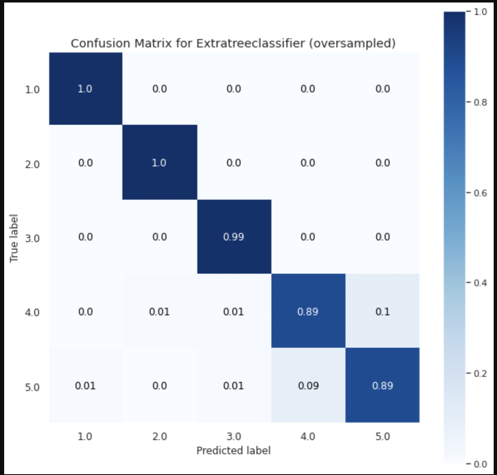
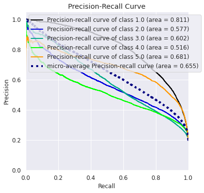

# Abstract[^1]
[^1]:Abstract

The world is drastically shifting towards the era of online shopping and social media. People find it extremely feasible and less time-consuming to shop online by just sitting and shopping for anything and everything they need from the comfort of their homes. This leads to minimal customer-manufacturer interaction and for this reason, it raises a concern for the suppliers to figure out their product performance and analyze feedback. A manufacturer requires constant feedback on how their products are doing in the market and the level of customer satisfaction that they are delivering. Therefore, to address this, we have a need for sentiment classification of consumer feedback and product reviews that are purchased by consumers on online platforms. This approach will help in categorizing data based on certain attributes which will make it easier to analyze and observe the trends/reviews of products. In this project, we have implemented various machine learning models for reviews prediction and sentiment classification. We have compared the performance of different models to determine which model performs the best for our data. 

# 1. Introduction[^2]
[^2]:Introduction

With the rise in online shopping these days, companies are quickly improving their online services for their customers. Different brands are constantly working to figure out ways to retain their existing customers while also attracting new customers. Customer satisfaction and online reviews play a big part in businesses today. Understanding the performance and reviews of their products is crucial for both producers and sellers in the internet age. Artificial Intelligence and Machine Learning is widely being used for this purpose. Depending on the type of data and the domain for which it is used, many machine learning models are available that can be deployed based on the performance. Determining the review rating of a given product or whether the review on a given product is positive or negative will help in correlating to the customer's satisfaction and improving the sales of these products. 

The objective of this project is to explore and implement different machine learning models for online product reviews dataset and study the performance of each model. We have used [Amazon and Best Buy Electronics](https://data.world/datafiniti/amazon-and-best-buy-electronics) and [Grammar and Online Product Reviews](https://data.world/datafiniti/grammar-and-online-product-reviews) data. We compare the performance of each model based on classification report or f1 scores, and with the help of confusion matrices to understand and evaluate the models performance. 

# 2. Data[^3]
[^3]:Data

The data used for this project is [Amazon and Best Buy Electronics](https://data.world/datafiniti/amazon-and-best-buy-electronics) and [Grammar and Online Product Reviews](https://data.world/datafiniti/grammar-and-online-product-reviews) data. This is a list of over 7,000 online reviews for 50 electronic products from websites like Amazon and Best Buy and a list of over 71,045 reviews from 1,000 different products provided by Datafiniti's Product Database.

## 2.1 Data Cleaning and Preprocessing

The performance of any machine learning model depends significantly on data cleaning and pre-processing. Therefore, we have employed a selected number of techniques to clean the raw text data. The different types of pre-processing techniques used in this project are:

1) Lowercasing: Convert all the characters of the text in the reviews to lowercase. It is done to maintain the consistency of the text to train for predicting the output and avoid sparsity issues.

2) Lemmatization: It is a technique similar to stemming where the inflexions are removed and mapped to their corresponding root word. This technique is used to make all similar words to be uniform.

3) Stop-word removal: Stop-word removal is used to remove the commonly used words so that the model can focus on the keywords while training.

4) Drop Null and Duplicate values: The rows without the data for the essential metrics that are used to predict the output or containing duplicate records have been dropped from the dataset, and the columns that are not necessary have been omitted from the dataset.

## 2.2 Data Visualization

We plotted different graphs to understand the data and get some initial insights on the data. 

The distribution is mostly positive (4 and 5) and it implies that the customers are happy with the products they purchase. It is shown in Fig 1. below.

<!-- <figure style='width:90%'>

<figcaption align = "center">
	<b>\phantom{....}Fig 1: Distribution of ratings throughout data.</b>
</figcaption>
</figure> -->

The length of reviews for ratings 4 or 5 is more when compared to ratings 1, 2 or 3. The text in reviews for the ratings 4 and 5 is more and this gives more data for us to analyze these positive reviews. The plot is shown in Fig 2. below. 

<!-- <figure style='width:90%'>

<figcaption align = "center">
	<b>\phantom{....}Fig 2: Review length for each review rating.</b>
</figcaption>
</figure> -->

The most frequently used words gives us an overview of what words effect the reviews positively or negatively. The plot is shown in Fig 3 below.

<!-- <figure style='width:90%'>

<figcaption align = "center">
	<b>\phantom{....}Fig 3: Most frequently used words in the reviews text.</b>
</figcaption>
</figure> -->

## 2.3 Handling Data Imbalance

An imbalance in the dataset can result in a biased training model, towards the majority class. In order to tackle this problem, the following resampling techniques were used:

1) Under-sampling - This method focuses on reducing the sample size of all the classes to the size of the minority class. Near Miss technique was used to implement under-sampling in the data set. Although this technique balances the data points, it eliminates good sample points, thereby leading to a decrease in the performance of the model.

2) Over-sampling - This method focuses on upscaling the sample sizes of all the classes based on the majority class size. SMOTE technique was used to implement this part of the code. SMOTE produces synthetic samples based on the already existing samples in each class. Oversampled data performed better than the under-sampled one in all the classification/regression methods.

# 3. Methods[^4]
[^4]:Methods

## 3.1 Logistic Regression: 

It is a linear classification model which is used to predict/classify the outcome from a determined set of outputs. In statistics, the logistic model (or logit model) is a statistical model that models the probability of an event taking place by having the log-odds for the event, with linear combination of one or more independent variables. In regression analysis, logistic regression (or logit regression) is estimating the parameters of a logistic model (the coefficients in the linear combination). Though Logistic Regression is easier to implement and works well with linearly separable data, it is rare to find such data in the real world.

<!-- <figure style='width:90%'>

<figcaption align = "center">
	<b>\phantom{....}Fig 4: Logistic Regression</b>
</figcaption>
</figure> -->

The training accuracy scores for the implemented logistic regression model are 0.92, 0.93 and 0.90 respectively for the undersampled, unsampled and oversampled data points. The F1 scores achieved on using logistic regression are 0.91, 0.92 and 0.89 respectively for the undersampled, unsampled and oversampled data. The confusion matrix and precision recall curve are plotted below to show the performance of classification per each class. 

<!-- <figure style='width:90%'>

<figcaption align = "center">
	<b>\phantom{....}Fig 5: Confusion matrix for Logistic Regression (Ovversampled)</b>
</figcaption>
</figure>

<figure style='width:90%'>

<figcaption align = "center">
	<b>\phantom{....}Fig 6: Precision-recall curve for Logistic Regression (Ovversampled)</b>
</figcaption>
</figure> -->

## 3.2 Random Forest Classifier: 

Random Forest is a supervised learning decision tree based model. On randomly chosen data samples, random forest classifier generates decision trees, collect predictions from each tree, then vote on the best response. Additionally, it offers a fairly accurate indication of the feature's relevance.
  
<!-- <figure style='width:90%'>

<figcaption align = "center">
	<b>\phantom{....}Fig 7: Random Forest Classifier</b>
</figcaption>
</figure> -->

We have achieved a training score of 0.99 for undersampled, unsampled and oversampled Random Forest Classification models. The F1 scores achieved on random forest classifier are 0.61, 0.72, 0.93 respectively for the undersampled, unsampled and oversampled data. The confusion matrix and precision recall curve are plotted below to show the performance of classification per each class. 

<!-- <figure style='width:90%'>

<figcaption align = "center">
	<b>\phantom{....}Fig 8: Confusion matrix for Random Forest Classifier (Ovversampled)</b>
</figcaption>
</figure>

<figure style='width:90%'>

<figcaption align = "center">
	<b>\phantom{....}Fig 9: Precision-recall curve for Random Forest Classifier (Ovversampled)</b>
</figcaption>
</figure> -->

## 3.3 ExtraTrees Classifier: 

ExtraTrees Classifier is a decision tree-based model that is similar to Random Forest Classifier and differs from it only in how the decision trees in the forest are built. In Extra Trees, randomness doesn't come from bootstrapping of data, but rather comes from the random splits of all observations.

<!-- <figure style='width:90%'>

<figcaption align = "center">
	<b>\phantom{....}Fig 10: ExtraTrees Classifier</b>
</figcaption>
</figure> -->

Similar to the Random Forest Classifier, the ExtraTrees classifier model has obtained the training score of 0.99 for the three different considered data samples. However, the F1 score reported for oversampled data is little better than the aforementioned. The F1 scores achieved on Extra trees classifier are 0.61, 0.72, 0.95 respectively for the undersampled, unsampled and oversampled data. The confusion matrix and precision recall curve are plotted below to show the performance of classification per each class. 

<!-- <figure style='width:90%'>

<figcaption align = "center">
	<b>\phantom{....}Fig 11: Confusion matrix for Extra Trees Classifier (Ovversampled)</b>
</figcaption>
</figure>

<figure style='width:90%'>

<figcaption align = "center">
	<b>\phantom{....}Fig 12: Precision-recall curve for Extra Trees Classifier (Ovversampled)</b>
</figcaption>
</figure> -->

## 3.4 XGBoost Classifier:  

In XGBoost classifier, each independent variable is given a weight before passing it as an input to the decision tree. Variables that the tree incorrectly predicted are given more weight before being placed into the second decision tree. These distinct classifiers/predictors are then combined to produce a robust and accurate model.

<!-- <figure style='width:90%'>

<figcaption align = "center">
	<b>\phantom{....}Fig 13: XGBoost Classifier</b>
</figcaption>
</figure> -->

The model training scores in the XgBoost classifier for oversampled, unsampled and undersampled data points are 0.59, 0.69 and 0.63 respectively. The F1 scores achieved on XGBoost classifier are 0.55, 0.69, 0.60 respectively for the undersampled, unsampled and oversampled data. Oversampling didn't work out well for this model. The confusion matrix and precision recall curve are plotted below to show the performance of classification per each class. 

<!-- <figure style='width:90%'>

<figcaption align = "center">
	<b>\phantom{....}Fig 14: Confusion matrix for XGBoost Classifier (Ovversampled)</b>
</figcaption>
</figure>

<figure style='width:90%'>

<figcaption align = "center">
	<b>\phantom{....}Fig 15: Precision-recall curve for XGBoost Classifier (Ovversampled)</b>
</figcaption>
</figure> -->

## 3.5 KNN Classification: 

K-Nearest Neighbors is a non-linear classification method that calculates the Euclidean distance between the target point and k number of neighboring points and then classifies the output accordingly. The value of K determines the accuracy of the classification model. 

<!-- <figure style='width:90%'>

<figcaption align = "center">
	<b>\phantom{....}Fig 16: KNeighbors Classifier</b>
</figcaption>
</figure> -->

The training scores obtained for the undersampled, unsampled and oversampled data in KNN classification are 0.48, 0.91 and 0.86 respectively. The F1 scores achieved on KNeighbors classifier are 0.26, 0.43, 0.82 respectively for the undersampled, unsampled and oversampled data. The confusion matrix and precision recall curve are plotted below to show the performance of classification per each class. 

<!-- <figure style='width:90%'>

<figcaption align = "center">
	<b>\phantom{....}Fig 17: Confusion matrix for KNN Classifier (Ovversampled)</b>
</figcaption>
</figure>

<figure style='width:90%'>

<figcaption align = "center">
	<b>\phantom{....}Fig 18: Precision-recall curve for KNN Classifier (Ovversampled)</b>
</figcaption>
</figure> -->

## 3.6 SVM Classifier: 

This is a type of supervised machine learning algorithm that performs classification or regression tasks. It classifies the data points using a hyperplane that has the maximum margin between the classes.

<!-- <figure style='width:90%'>

<figcaption align = "center">
	<b>\phantom{....}Fig 19: SVM Classifier</b>
</figcaption>
</figure> -->

The SVM classification model has been implemented only for the unsampled data and under-sampled data points as the model for oversampled data points took > 2 hrs to run.

The achieved model training accuracy for unsampled data is 0.76 while it is 0.75 for undersampled data. The confusion matrix for both the models has been plotted using the error metric values.

<!-- <figure style='width:90%'>

<figcaption align = "center">
	<b>\phantom{....}Fig 20: Confusion matrix for SVM Classifier (Ovversampled)</b>
</figcaption>
</figure> -->

# 4. Results and Comparison[^5]
[^5]:Results

We have implemented all the models on unsampled, undersampled and oversampled data and evaluated them on F1 score metric. A confusion matrix for the ratings 1 - 5 and a precision-recall curve for each class label are plotted to observe the classification performance. We have also calculated the log loss to compare the different implemented models. Finally, we gave custom test inputs to the models to judge the review prediction. 

The 2 step-learning process was implemented and validated. For models such as RandomForestClassifier, ExtraTreeClassifier and Logistic Regression, the training accuracy score on the oversampled data is > 90 and the micro average F1 score is >= 89.

<!-- <figure style='width:90%'>

<figcaption align = "center">
	<b>\phantom{....}Table 1: Results comparison for all the models.</b>
</figcaption>
</figure> -->

According to the above table, oversampled data outperformed undersampled/unsampled data. The corresponding confusion matrix and precision-recall curves of each model that are shown in this report are provided in the GitHub path: project_dir/paper/images folder.

# Conclusion[^6]
[^6]:conclusion

1) Results from under-sampled and oversampled data were found to differ noticeably, with the oversampled dataset appearing to be more favorable for most models.

2) Sampling the data points has helped us in handling the data imbalance and preventing biased model training.

3) For Random forest classifier and Extra tree classifier, the rating classifcation is accurate. The models trained on oversampled data gave good F1 scores and were able to perform well even for custom input cases. For logistic regression, the ratings are divided as sentiments and this model has also performed well, with good F1 score and accurate sentiment prediction of custom test inputs. 

4) We can further train other models using Neural Networks. This can be used to predict the performance of a product in the market based on its specific features and the correlation between products possessing those attributes and their customer satisfaction ratios.

# References

[1] "Preprocessing techniques for text-classification", towardsdatascience.com, https://towardsdatascience.com/effectively-pre-processing-the-text-data-part-1-text-cleaning-9ecae119cb3e (accessed Oct. 30, 2022)

[2] "Sentiment Analysis for Text Classification", medium.com, https://medium.com/analytics-vidhya/sentiment-classification-of-yelp-data-293f401c3656 (accessed Nov. 25, 2022)
