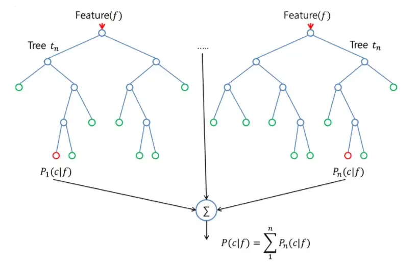

  
  

# Abstract

The world is drastically shifting towards the era of online shopping and social media. People find it extremely feasible and less time-consuming to shop online by just sitting and shopping for anything and everything they need from the comfort of their homes. This leads to minimal customer-manufacturer interaction and for this reason, it raises a concern for the suppliers to figure out their product performance and analyze feedback. A manufacturer requires constant feedback on how their products are doing in the market and the level of customer satisfaction that they are delivering. Therefore, to address this, we have a need for sentiment classification of consumer feedback and product reviews that are purchased by consumers on online platforms. This approach will help in categorizing data based on certain attributes which will make it easier to analyze and observe the trends/reviews of products. In this project, we have implemented various machine learning models for reviews prediction and sentiment classification. We have compared the performance of different models to determine which model performs the best for our data. 

# Method

With the rise in online shopping these days, companies are quickly improving their online services for their customers. Different brands are constantly working to figure out ways to retain their existing customers while also attracting new customers. Customer satisfaction and online reviews play a big part in businesses today. Understanding the performance and reviews of their products is crucial for both producers and sellers in the internet age. Artificial Intelligence and Machine Learning is widely being used for this purpose. Depending on the type of data and the domain for which it is used, many machine learning models are available that can be deployed based on the performance. Determining the review rating of a given product or whether the review on a given product is positive or negative will help in correlating to the customer's satisfaction and improving the sales of these products. 

The objective of this project is to explore and implement different machine learning models for electronic product reviews dataset and study the performance of each model. We have used [Amazon and Best Buy Electronics] and [Grammar and Online Product Reviews] data. This is a list of over 7,000 online reviews for 50 electronic products from websites like Amazon and Best Buy and a list of over 71,045 reviews from 1,000 different products provided by Datafiniti's Product Database. Different error metrics are computed, and their corresponding confusion matrix are plotted, to understand the model's performance. We compare each model's performance to the other models based on these error metrics. 

# Data Cleaning and Preprocessing

The performance of any machine learning model depends significantly on data cleaning and pre-processing. Therefore, we have employed a selected number of techniques to clean the raw text data. The different types of pre-processing techniques used in this project are:

1) Lowercasing: Convert all the characters of the text in the reviews to lowercase. It is done to maintain the consistency of the text to train for predicting the output and avoid sparsity issues.

2) Lemmatization: It is a technique similar to stemming where the inflexions are removed and mapped to their corresponding root word. This technique is used to make all similar words to be uniform.

3) Stop-word removal: Stop-word removal is used to remove the commonly used words so that the model can focus on the keywords while training.

4) Drop Null and Duplicate values: The rows without the data for the essential metrics that are used to predict the output or containing duplicate records have been dropped from the dataset, and the columns that are not necessary have been omitted from the dataset.

## Handling Data Imbalance

An imbalance of data sets can result in a biased training model, towards the majority class. In order to tackle this problem, certain methods were experimented with.

Under-sampling - This method focuses on reducing the sample size of all the classes to the size of the minority class. Near Miss technique was used to implement under-sampling in the data set. Although this technique balances the data points, it eliminates good sample points, thereby leading the model to not perform the best.

Over-sampling - This method focuses on upscaling the sample sizes of all the classes based on the majority class size. SMOTE technique was used to implement this part of the code. SMOTE produces synthetic samples based on the already existing samples in each class. Oversampled data performed better than the under-sampled one in all the classification/regression methods.

# Models

## RandomForest Classifier: 

Random Forest is a supervised learning decision tree based model. On randomly chosen data samples, random forests generate decision trees, collect predictions from each tree, then vote on the best response. Additionally, it offers a fairly accurate indication of the feature's relevance.
  

We have achieved a training score of 0.99 for undersampled, unsampled and oversampled Random Forest Classification models. A confusion matrix and precision-recall have also been plotted from the error metric values to visualize the performance of the model.

## KNN Classification: 

K-Nearest Neighbors is a non-linear classification method that calculates the Euclidean distance between the target point and k number of neighboring points and then classifies the output accordingly. The value of K determines the accuracy of the classification model. 

The training scores obtained for the undersampled, unsampled and oversampled data in KNN classification are 0.48, 0.91 and 0.86 respectively. The precision-recall curve for different ratings has been plotted along with the confusion matrix.

## SVM Classifier: 
This is a type of supervised machine learning algorithm that performs classification or regression tasks. It classifies the data points using a hyperplane that has the maximum margin between the classes.

The SVM classification model has been implemented only for the unsampled data and under-sampled data points as the model for oversampled data points took > 2 hrs to run.

The achieved model training accuracy for unsampled data is 0.76 while it is 0.75 for undersampled data. The confusion matrix for both the models has been plotted using the error metric values.

## ExtraTrees Classifier: 

ExtraTrees Classifier is a decision tree-based model that is similar to Random Forest Classifier and differs from it only in how the decision trees in the forest are built. In Extra Trees, randomness doesn’t come from bootstrapping of data, but rather comes from the random splits of all observations.

Similar to the Random Forest Classifier, the ExtraTrees classifier model has obtained the training score of 0.99 for the three different considered data samples. However, the precision-recall curve values are better than the aforementioned model.

## XgBoost Classifier:  

Each independent variable is given a weight before being input into the decision tree that predicts outcomes. Variables that the tree incorrectly predicted are given more weight before being placed into the second decision tree. These distinct classifiers/predictors are then combined to produce a robust and accurate model.

The model training scores in the XgBoost classifier for oversampled, unsampled and undersampled data points are 0.59, 0.69 and 0.63 respectively. Their corresponding confusion matrix and precision-recall curves have been plotted accordingly.

## Logistic Regression: 

It is a linear classification model which is used to predict/classify the outcome from a determined set of outputs. Though Logistic Regression is easier to implement and works well with linearly separable data, it is rare to find such data in the real world.

The training accuracy scores for the implemented logistic regression model are 0.92, 0.93 and 0.90 respectively for the undersampled, unsampled and oversampled data points.
